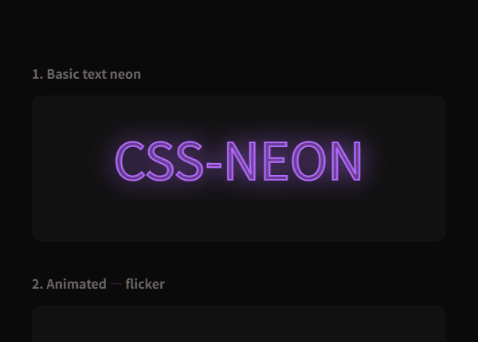

# css-neon — `<neon-light>` Web Component

纯原生 ES Module 霓虹灯特效 Web Component，基于 Shadow DOM v1 和 Custom Elements v1。支持文字和 SVG 两种内容，通过 CSS + SVG filter 实现霓虹发光效果。



## 项目结构

```
css-neon/
├── src/                  # 源代码（6 个模块）
│   ├── index.js          # 入口 — 注册 + 公开 API
│   ├── neon-light.js     # Web Component 类
│   ├── renderer.js       # SVG 渲染引擎
│   ├── animations.js     # CSS 动画生成器
│   ├── config.js         # 配置级联
│   └── utils.js          # 工具函数
├── build/
│   └── bundle.js         # 构建脚本 → 生成 css-neon.js
├── test/                 # 测试页面
├── demo/                 # 功能演示页面
├── docs/                 # HTML 文档
├── css-neon.js           # 生产文件（由 build/bundle.js 生成）
└── README.md
```

## 构建

从源码生成生产文件 `css-neon.js`：

```bash
node build/bundle.js
```

### 构建流程

1. 读取 `src/index.js`（入口模块）
2. 递归解析 `import { ... } from './...'` 语句，构建依赖图
3. 按依赖顺序合并模块（被依赖的在前）：

```
utils.js → config.js → animations.js → renderer.js → neon-light.js → index.js
```

4. 剥离所有内部 `import` / `export` 声明
5. 保留 `index.js` 的公开 API：`export { NeonLight, define }`
6. 写入 `css-neon.js`（约 700 行 / 22 KB，零外部依赖）

### 模块说明

| 模块 | 职责 |
|------|------|
| `src/utils.js` | SVG 命名空间、元素创建、类型转换 |
| `src/config.js` | 默认值、属性观察列表、配置级联解析 |
| `src/animations.js` | flicker / breath / glitch / broken / flow / chase / eclipse 七种 CSS 动画 |
| `src/renderer.js` | Light DOM 解析、文字/SVG 双层渲染、per-path 配置 |
| `src/neon-light.js` | Custom Element 类：Shadow DOM、ResizeObserver、MutationObserver |
| `src/index.js` | 入口：自动注册 `<neon-light>`、公开 `define()` API |

构建脚本仅依赖 Node.js 内置模块（`fs`、`path`），无需安装任何第三方包。

## 快速开始

```html
<script type="module" src="css-neon.js"></script>

<neon-light color="#ff69b4" glow="12" font-size="64"
            style="width:600px;height:120px">
  霓虹灯效果
</neon-light>
```

## Light DOM 内容

`<neon-light>` 内部可以放置两种内容，按从左到右的流式布局排列：

| 内容类型 | 说明 |
|----------|------|
| 纯文本 | 渲染为霓虹发光文字 |
| `<svg>` 元素 | 提取内部形状（path/circle/rect 等）渲染为霓虹描边 |

```html
<!-- 文字 + SVG 图标 -->
<neon-light color="#ff69b4" glow="10" font-size="48"
            style="width:700px;height:120px">
  NEON
  <svg viewBox="0 0 24 24" width="48" height="48">
    <circle cx="12" cy="12" r="10"/>
  </svg>
</neon-light>
```

### 外部 SVG 文件（`src` 属性）

通过 `src` 属性直接引用外部 SVG 文件，无需 JavaScript：

```html
<neon-light color="#00ccff" glow="12"
            svg-animate="flow" svg-stroke-width="4"
            src="css-neon.svg" svg-width="300" svg-height="100"
            style="width:300px;height:100px">
</neon-light>
```

| 属性 | 类型 | 默认值 | 说明 |
|------|------|--------|------|
| `src` | URL | — | 外部 SVG 文件路径，文件加载后自动 append 到 Light DOM |
| `svg-width` | number | 文件原始宽度 | 覆盖外部 SVG 的显示宽度 |
| `svg-height` | number | 文件原始高度 | 覆盖外部 SVG 的显示高度 |

### 字体加载与文字路径化（`font-src` 属性）

通过 `font-src` 加载 TTF/OTF/WOFF 字体文件，将文字转为 SVG  glyph 路径渲染。路径化后，文字支持 SVG 专属动画（broken / flow）和 per-character 配置：

```html
<neon-light color="#ffaa00" glow="5"
            svg-animate="broken" broken-ratio="0.3" svg-stroke-width="3"
            font-src="fonts/Inter-Regular.ttf"
            font-size="72" style="width:700px;height:180px">
  CSS-NEON
</neon-light>
```

| 属性 | 类型 | 默认值 | 说明 |
|------|------|--------|------|
| `font-src` | URL | — | 字体文件路径（TTF/OTF/WOFF），字体按类级别缓存，多个实例共享 |

> **注意**：`font-src` 不支持 WOFF2 格式。如需使用 WOFF2 字体，请先转换为 TTF/WOFF。
>
> 字体加载通过 opentype.js（动态 import `esm.sh`）解析，失败时自动回退到标准文字渲染。

---

## 属性参数

### 全局属性（同时作用于文字和 SVG）

以 kebab-case 形式写在 `<neon-light>` 标签上。

| 属性 | 类型 | 默认值 | 说明 |
|------|------|--------|------|
| `color` | color | `#ff69b4` | 霓虹灯颜色 |
| `glow` | number | `10` | 外发光强度（影响 blur 的 stroke-width 倍率） |
| `blur` | number | `4` | 高斯模糊量（`feGaussianBlur` 的 stdDeviation） |
| `animate` | string | `none` | 动画预设：见[动画预设](#动画预设)章节 |
| `speed` | number | `1` | 动画速度倍率，越大越快 |
| `dashed` | boolean | `false` | 是否启用虚线描边效果 |
| `broken-ratio` | number | `0.5` | 破管比例 0–1，仅在 `svg-animate="broken"` 时生效 |
| `chase-delay` | number | `0.3` | chase 动画每字闪烁间隔（秒） |
| `eclipse-delay` | number | `0.3` | eclipse 动画每字变暗间隔（秒） |
| `src` | URL | — | 外部 SVG 文件路径 |
| `svg-width` | number | — | SVG 显示宽度（配合 `src` 或内联 SVG） |
| `svg-height` | number | — | SVG 显示高度（配合 `src` 或内联 SVG） |
| `font-src` | URL | — | 字体文件路径（TTF/OTF/WOFF），加载后将文字转为路径 |
| `path-config` | string | — | Per-path / per-char 配置字符串 |
| `vertical` | boolean | `false` | 竖排文字模式（逐字纵向排列） |

### 文字专属属性（`text-*` 前缀）

覆盖全局属性，仅作用于文字部分。命名规则：`text-` + 全局属性名。

| 属性 | 覆盖 |
|------|------|
| `text-color` | `color` |
| `text-glow` | `glow` |
| `text-blur` | `blur` |
| `text-animate` | `animate` |
| `text-speed` | `speed` |
| `text-dashed` | `dashed` |
| `text-vertical` | `vertical` |
| `text-chase-delay` | `chase-delay` |
| `text-eclipse-delay` | `eclipse-delay` |

```html
<!-- 文字呼吸动画，绿色；SVG 常亮，粉红色 -->
<neon-light
  color="#ff69b4" glow="10"
  text-color="#00ffcc" text-animate="breath"
  font-size="48" style="width:700px;height:120px">
  NEON
  <svg viewBox="0 0 24 24" width="48" height="48">
    <circle cx="12" cy="12" r="10"/>
  </svg>
</neon-light>
```

### 竖排文字（`vertical`）

启用后文字逐字纵向排列（从上到下），支持标准文字和 `font-src` 路径化两种渲染路径。

```html
<neon-light color="#ff69b4" glow="12" vertical font-size="48"
            style="width:200px;height:400px">
  CSS-NEON
</neon-light>
```

| 属性 | 类型 | 默认值 | 说明 |
|------|------|--------|------|
| `vertical` | boolean | `false` | 全局竖排 |
| `text-vertical` | boolean | — | 仅文字竖排（覆盖 `vertical`） |

竖排模式下，CJK 字符和拉丁字符均可正常工作。容器需要较高较窄（width 200px / height 400px 左右）。

### SVG 专属属性（`svg-*` 前缀）

覆盖全局属性，仅作用于 SVG 形状。命名规则：`svg-` + 全局属性名。

| 属性 | 类型 | 默认值 | 说明 |
|------|------|--------|------|
| `svg-color` | color | — | 覆盖 `color` |
| `svg-glow` | number | — | 覆盖 `glow` |
| `svg-blur` | number | — | 覆盖 `blur` |
| `svg-animate` | string | — | 覆盖 `animate`；额外支持 `broken`、`flow`、`chase`、`eclipse` |
| `svg-speed` | number | — | 覆盖 `speed` |
| `svg-dashed` | boolean | — | 覆盖 `dashed` |
| `svg-stroke-width` | number | `10` | SVG 形状描边宽度 |
| `svg-broken-ratio` | number | — | 覆盖 `broken-ratio` |
| `svg-chase-delay` | number | — | 覆盖 `chase-delay` |
| `svg-eclipse-delay` | number | — | 覆盖 `eclipse-delay` |

## 配置级联规则

```
text-* > svg-* > 全局属性 > 默认值
```

每种属性只影响对应的内容类型：
- 文字渲染使用 `text-*` → 全局属性 → 默认值 的优先级
- SVG 渲染使用 `svg-*` → 全局属性 → 默认值 的优先级

---

## 动画预设

### 通用动画（文字和 SVG 均可用）

| 值 | 效果 | 时长（speed=1） |
|----|------|-----------------|
| `none` | 无动画，常亮 | — |
| `flicker` | 不规则闪烁，模拟霓虹灯管 | 6s 循环 |
| `breath` | 平滑呼吸式明暗渐变 | 4s 循环 |
| `glitch` | 故障效果，伴随颜色偏移和闪烁 | 3s 循环 |

```html
<neon-light color="#ff3355" animate="glitch" speed="1.5"
            font-size="64" style="width:600px;height:120px">
  GLITCH
</neon-light>
```

### 逐字闪烁动画（chase / eclipse）

对文字逐字生效。如果通过 `font-src` 加载了字体，需要改用 `svg-animate` 触发。

| 值 | 效果 |
|----|------|
| `chase` | 所有字初始全暗，闪光从左到右逐字点亮，每次一个字亮 |
| `eclipse` | 所有字初始全亮，暗斑从左到右逐字扫过，每次一个字暗 |

`chase-delay`（默认 0.3）控制每字之间的闪烁间隔（秒）。值越小光斑移动越快，值越大越从容。

```html
<!-- 标准文字 chase：光斑逐字扫过 -->
<neon-light color="#ff69b4" glow="10" animate="chase" chase-delay="0.3"
            font-size="64" speed="1" style="width:700px;height:180px">
  CSS-NEON
</neon-light>

<!-- eclipse：亮字逐字变暗 -->
<neon-light color="#ff69b4" glow="10" animate="eclipse" eclipse-delay="0.5"
            font-size="64" style="width:700px;height:180px">
  CSS-NEON
</neon-light>

<!-- font-src 路径化 chase（需用 svg-animate） -->
<neon-light color="#00ccff" glow="8"
            svg-animate="chase" chase-delay="0.25" svg-stroke-width="3"
            font-src="fonts/Inter-Regular.ttf"
            font-size="72" style="width:700px;height:180px">
  CSS-NEON
</neon-light>
```

### SVG 专属动画

对 SVG 形状生效。如果通过 `font-src` 加载了字体，文字也会被转为路径，此时 broken / flow 同样对文字生效。

| 值 | 效果 |
|----|------|
| `broken` | 断管效果：部分 path 变暗并闪烁，模拟接触不良的霓虹灯管 |
| `flow` | 流光效果：亮点沿路径前进的滚动光效 |

```html
<!-- SVG 断管效果：30% 的 path 显示为故障暗管 -->
<neon-light color="#ffaa00" glow="14"
            svg-animate="broken" broken-ratio="0.3"
            svg-stroke-width="5"
            src="beer.svg" svg-width="72" svg-height="72"
            style="width:700px;height:180px">
</neon-light>

<!-- SVG 流光效果 -->
<neon-light color="#00ccff" glow="12"
            svg-animate="flow" svg-stroke-width="4"
            src="css-neon.svg" svg-width="300" svg-height="100"
            style="width:300px;height:100px">
</neon-light>

<!-- 文字断管效果（需配合 font-src） -->
<neon-light color="#ffaa00" glow="5"
            svg-animate="broken" broken-ratio="0.3" svg-stroke-width="3"
            font-src="fonts/Inter-Regular.ttf"
            font-size="72" style="width:700px;height:180px">
  CSS-NEON
</neon-light>
```

---

## Per-Path / Per-Char 配置（`path-config`）

可以对 SVG 中特定的 `<path>` 或文字路径化后的每个字符单独设置颜色和破管状态。

### 语法

```
path-config="<id>: <key>:<value>, <key>:<value>; <id>: ..."
```

- 每条规则用 `;` 分隔
- 每条规则内属性用 `,` 分隔
- 键值对用 `:` 分隔
- **SVG 路径**：`<id>` 匹配元素 `id` 或 `p-id` 属性
- **文字字符**（需 `font-src`）：`<id>` 为字符索引（0-based），如 `0` 代表第一个字符

### 支持的属性

| 属性 | 值 | 说明 |
|------|-----|------|
| `color` | CSS 颜色值 | 覆盖该 path/字符 的描边颜色 |
| `broken` | `true` / `false` / `1` / `0` | 强制该 path/字符 为破管或正常状态 |

### 破管分配逻辑

1. `broken:true` 的 path 始终为破管
2. `broken:false` 的 path 始终为正常
3. 未指定的 path 由全局 `broken-ratio` 决定，通过内容 hash 确定性选取

### 示例

```html
<!-- SVG per-path：精确控制每个 path 的颜色和破管状态 -->
<neon-light color="#ffaa00" glow="14"
            svg-animate="broken" broken-ratio="0.5"
            svg-stroke-width="5"
            path-config="5739: color:#ff4444, broken:true; 5741: color:#4488ff, broken:false"
            src="beer.svg" svg-width="72" svg-height="72"
            style="width:700px;height:180px">
</neon-light>

<!-- 文字 per-char（需 font-src）：控制每个字符的颜色和破管状态 -->
<neon-light color="#ffaa00" glow="5"
            svg-animate="broken" broken-ratio="0.5" svg-stroke-width="3"
            font-src="fonts/Inter-Regular.ttf"
            path-config="0: color:#ff4444, broken:true; 3: color:#44ff88; 5: color:#4488ff, broken:true"
            font-size="72" style="width:700px;height:180px">
  CSS-NEON
</neon-light>
```

---

## 排版属性

所有排版属性仅作用于文字内容。

| 属性 | 类型 | 默认值 | 说明 |
|------|------|--------|------|
| `font-family` | string | `inherit` | 字体族 |
| `font-size` | number | `64` | 字号（px） |
| `font-weight` | string | `normal` | 字重 |
| `font-style` | string | `normal` | 字体样式 |
| `text-transform` | string | `none` | 文字变形 |
| `letter-spacing` | number | `0` | 字间距（px） |

---

## CSS 自定义属性

可在 `<neon-light>` 上通过 `style` 属性覆盖：

| 属性 | 默认值 | 说明 |
|------|--------|------|
| `--neon-back-opacity` | `0.6` | 外发光层（back layer）整体不透明度 |
| `--neon-front-opacity` | `1` | 内核层（front layer）整体不透明度 |
| `--neon-color` | 由属性设定 | 可在 CSS 中引用当前 neon 颜色 |

```html
<neon-light color="#00ffcc" glow="12" font-size="64"
            style="width:600px;height:120px;--neon-back-opacity:0.8">
  BRIGHT GLOW
</neon-light>
```

---

## JavaScript API

```js
import { NeonLight, define } from './css-neon.js';

// 自动注册（默认标签名 <neon-light>）
define();

// 自定义标签名
define('my-neon', NeonLight);
```

`NeonLight` 继承自 `HTMLElement`，所有标准 DOM API 均可使用：

```js
const el = document.querySelector('neon-light');
el.setAttribute('color', '#ff0000');  // 自动触发重渲染
el.setAttribute('animate', 'flicker');
```

---

## 浏览器兼容性

需要支持以下 API 的现代浏览器：

- Custom Elements v1 (`customElements.define`)
- Shadow DOM v1 (`attachShadow`)
- SVG 1.1 (`createElementNS`, `feGaussianBlur`)
- ES Modules
